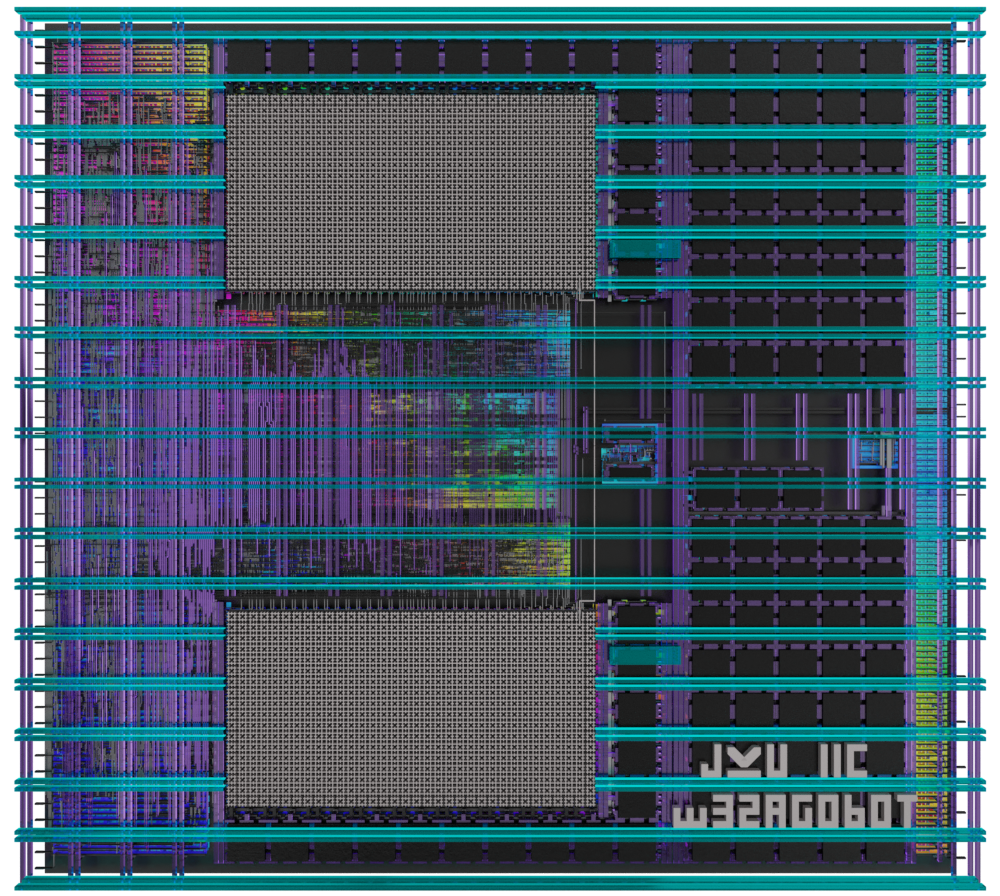

# Design of a Non-Binary Charge-Redistribution SAR-ADC utilizing the SKY130 Open-Source Technology
Manuel Moser, 2023, Johannes Kepler University JKU Linz, Austria, Institute for Integrated Circuits IIC

# Abstract
 This design is a nonbinary, asynchronous (= self-clocked) 12b SAR ADC (Successive Approximation Register Analog Digital Converter), using a segmented 9+3 bit capacitive DAC with a thermometer-coded 9b capacitor array and 3b binary capacitor cells. The SAR-ADC Layout has previously been added to the [IIC Mixed-Signal Circuits Submission](https://github.com/iic-jku/mpw8-submission) for the Open MPW-8 Shuttle. 



## Features 
* Differential analog inputs
* ADC physical resolution of $12 bit$, up to $16 bit$ with oversampling
* Sample rate is presumably $1.5MS/s$ at the worst corner at the fastest mode of operation. With OSR and LSB averaging the ADC should be capable of sampling audio streams
* Nonbinary SAR weights for redundant error correction
* Oversampling FIR-boxcar-filter with 1/4/16/64/256 samples to improve SNR
* Averaging of 4 LSB bits with 1/3/7/15/31 samples to reduce the impact of comparator noise
* Integrated clock generation with configurable delays, implemented with an analog custom standard cell for the `sky130_fd_sc__hd_` library
* Switched capacitor voltage generator for the common-mode reference voltage integrated
* $12 bit$ capacitor DAC
  * Unit-capacitor with $C^{1}=0.447 fF$
  * Binary coded DAC-cells with 1x1, 1x2 and 1x4 unit-capacitors $C^{1}$ + $C^{2}$ + $C^{4}$ for LSB bits
  * Thermo-coded DAC-cells with 1x8 unit-capacitors $C^{8}=3.58fF$
  * 3 bit LSB binary cells $C^{1}$ + $C^{2}$ + $C^{4}$ and 9 bit MSB thermometer-coded cells $C^{8}_{1..511}$
  * Sum of $1.83pF$ per DAC matrix
* Cap-Matrix row/column decoder can be switched between sequential and symmetrical modes to decrease integral-nonlinearity-error
* Total area of $442 \mu m \cdot 402\mu m = 178.000 \mu m^2$
* 100% open source, licensed with [Apache 2.0](LICENSE)

# Top-Level Interface
The configuration bytes `config_1_in` and `config_2_in` are used to activate the sequential/symmetrical row/column decoder modes, and the delays in the self-clocked loop. The configuration is described in [doc/interface.md](doc/Interface.md). `rst_n` will reset the circuit active-low. After reset de-assertion the circuit waits for the trigger signal `start_conversion_in`, an edge-detection-circuit ensures only one conversion is triggered. A single conversion is done when `conversion_finished_out` changes to `HIGH`, additionally `conversion_finished_osr_out` signalizes a finished OSR sequence. Input `clk_vcm` is the clock signal for the switched-capacitor voltage generator, it is designed for a low frequency of 32768kHz.

```verilog
//Top module ADC Control
module adc_top(
   `ifdef USE_POWER_PINS
      inout VDD,	// User area 1.8V supply
      inout VSS,	// User area ground
   `endif
   input wire clk_vcm,        // 32.768Hz VCM generation clock
   input wire rst_n,          // reset
   input wire inp_analog,     // P differential input
   input wire inn_analog,     // N differential input
   input wire start_conversion_in,   
   input wire [15:0] config_1_in,    
   input wire [15:0] config_2_in,    
   output wire [15:0] result_out,       // format: {12 bit, 4 bit OSR extension}    
   output wire conversion_finished_out,
   output wire conversion_finished_osr_out
   );
```


