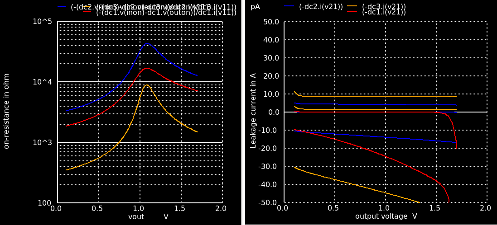
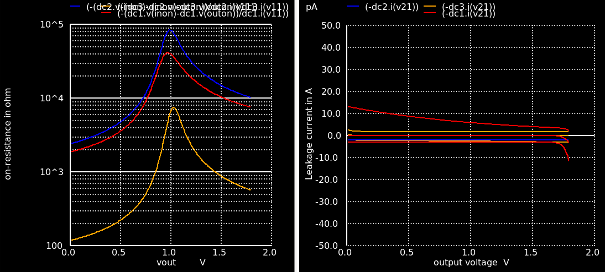
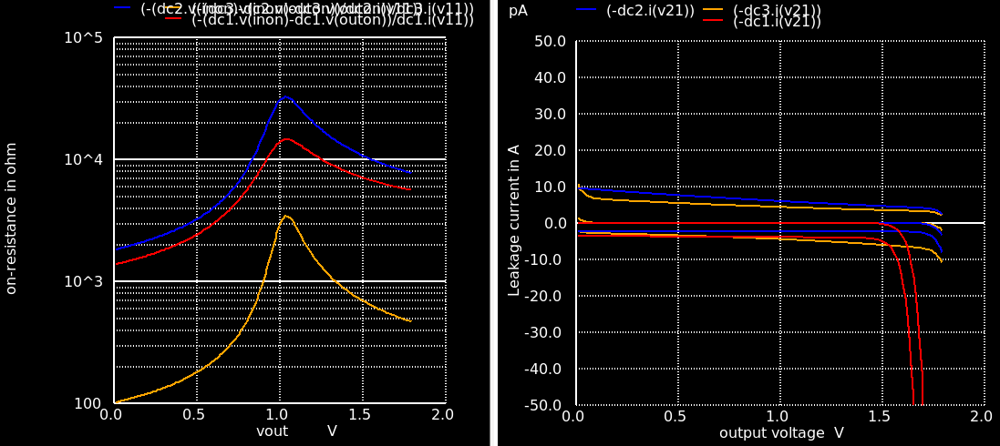

# ADC Gate Switch Dimensionierung
Evaluierung der problematischen Parasitics und Auswahl der Mosfet-Types (nom, lvt, hvt, thickoxide)
## Sampling-Phase
Der Gate-Switch soll bei minimaler Sampling-Periode bei Änderung der Eingangsspannung von $V_{in}=0V$ auf $V_{in}=1.8V$ die ADC-Cap auf $V_{cap}=V_{max}-1\cdot LSB$ aufladen können. 

### Berechnung der maximalen erlaubten Switch-Resistance

* Bei einem 12-Bit ADC ist $LSB=1.8V \cdot \frac{1}{4096}=440 \mu V$.
* Geht man vom kleinsten sinnvollen Delay aus, dann ist die kürzeste Clk-Periode des Digital-Clk $T_{clk}=20ns$. 
* Bei kontinuierlicher AD-Wandlung ist die kürzeste Samplezeit deshalb $\Delta t = 20 ns$. In dieser Zeit muss es möglich sein den ADC-Kondensator von $U_c(0)=0V$ auf $U_c(\Delta t)=1.8V \frac{4095}{4096}$ aufzuladen.
* Die längste Clk-Periode ist $T_{clk}=600ns$ (alle Delays auf maximal 100ns konfiguriert).

Der zeitabhängige Spannungsverlauf der Matrix-Kapazität $U_c(t)$ beim Aufladen ist 

$$U_c(t) = U_0 \left( 1-e^{-\frac{t}{RC}} \right) $$

Einsetzen von $t=\Delta t$ und anschließender Umformung führt zu

$$ln \left( \frac{U_0}{U_0-U_c(\Delta t)} \right)  = \frac{\Delta t}{RC}$$

Werte Einsetzen für $U_c(\Delta t) > 1.8V \frac{4095}{4096}$, $U_0=1.8V$ und $C=2.44pF$

$$ln(4096)  < \frac{\Delta t}{RC}$$

daraus folgt das Ergebnis für den erlaubten Kanalwiderstand

$$R<\frac{\Delta t}{C \cdot ln(4096)} = \frac{20ns}{2.44pF \cdot ln(4096)}=985\Omega$$

## Hold-Phase
Während der Hold-Phase soll sich der zuvor gesampelte Wert vom Originalwert um weniger als $1 \cdot LSB$ unterscheiden. Maßgeblich sind Charge-Injection und Leakage-Current.

## Berechnung des maximal erlaubten Leakage-Currents
Worst Case: 
* Bei langsamen Corner (`ss`, $T=-20 ^\circ C$, $V_{cm}=700mV$ ) benötigt das Comparator-Latch $\Delta t = 20 ns$ für eine Entscheidung, allerdings ist der Leakage-Current im  schnellen `ff`-Corner wichtiger. 
* Der Delay-Loop führt bei maximalem Delay-Setting zu ($\Delta t = 600 ns$) Periodendauer je Messwert. 
* Bei Averaging von 4 LSB-Bits mit je 31 Samples sind $12+4 \cdot 31=136$ Cycles für eine vollständige Umwandlung nötig. 
* Die erlaubte Spannungsänderung während der Hold-Phase ist $LSB=440uV$
* OSR ist hier nicht berücksichtigt, da nach einer erfolgten Wandlung neu gesampled wird.

Daraus folgt die maximale Hold-Zeit in der die Spannung am Kondensator gehalten werden muss: 

$$T_{hold} = 136 \cdot 600 ns=81.6 \mu s$$ 

Die zugehörige Sample-Rate (ohne Oversampling) ist:

$$Samplerate = 1/T_{hold}=12254/s$$

Die Spannung am Kondensator darf sich worst-case nach $\Delta t = 81.6 \mu s$ um $\Delta U_C < 1 LSB$ ändern.Der maximal erlaubte Leakage-Current im Off-Zustand errechnet sich nun aus der differentiellen Strom/Spannungsbeziehung für Kapazitäten:

$I_{leakage} = C \frac{\Delta U_c}{\Delta t} < C \frac{LSB}{\Delta t}=2.44 pF \frac{1.8V}{4096 \cdot 81.6 \mu s}=13.14 pA$  

Die Oversampling-Rate ist hier nicht zu berücksichtigen, weil nach $T_{hold}$ neu gesampled wird.

## Mögliche Sample-Rate im Worst-Case Corner
Angenommen im Delay-Loop ist die Summe der Delays auf sehr schnelle $T_{delays} = 10 ns$ eingestellt, und die Comparator-Entscheidungszeit beträgt $T_{decision} = 20ns$ bei $V_{cm}=700mV$, dann ist die Clock-Periodendauer $T_{loop}=2\cdot 10ns+20ns=40ns$. Bei 16 States für eine Wandlung (kein Average, kein OSR) ergibt das eine Samplerate von

$$Samplerate = 1/(16 \cdot 40ns)=1.56MSamples/s$$ 

## Mögliche Sample-Rate im Best-Case Corner
Hier liegt die Comparator-Entscheidungszeit bei  $T_{decision} = 2.2ns$.
$$Samplerate = 1/(16 \cdot 22.2ns)=2.84MSamples/s$$ 

# Switch Topologieauswahl bei Fast-Corner
Spezifikationen können hier nicht eingehalten werden, die Leakage Current wird zu hoch wenn man in einen okay'ishen On-Resistance-Bereich kommt

## 01V8 Nominal Mosfets
R zu hoch wenn Leakage current ebenfalls zu hoch
```tcl
red: w=0.42 L=0.15
blue: w=0.42 L=0.4
orange: W=4 L=0.4
```

Abb: Leakage Currents und Channel-Resistance bei worst case corner (ff 100°C)

## 01V8 LVT Mosfets
Die LVT Type hat ein großes Problem mit Leakage Currents
```tcl
red: w=0.42 L=0.35
blue: w=0.42 L=0.75
orange: W=4 L=0.75
```

Abb: Leakage Currents und Channel-Resistance bei worst case corner (ff 100°C)

## 01V8 HVT Mosfets
NMOS nominal und PMOS hvt
R zu hoch wenn Leakage current ebenfalls zu hoch
```tcl
red: w=0.42 L=0.15
blue: w=0.42 L=0.30
orange: W=4.2 L=0.30
```

Abb: Leakage Currents und Channel-Resistance bei worst case corner (ff 100°C)

## Thick Oxide 5V0 Mosfets
Mosfets 5v0 thick oxide type  
Leakage currents sind bei vergleichbarer Channel Resistance sogar noch höher als bei andere types
```tcl
red: w=0.42 L=0.5
blue: w=4 L=0.5
orange: W=16 L=0.5
```

Abb: Leakage Currents und Channel-Resistance bei worst case corner (ff 100°C)

# Mögliche Lösung
Bootstrapping-Switch. Wandlung um 1 Cycle verlängern, im IDLE Zustand das Bootstrapping vorbereiten, dann erst im ersten Takt den Switch durchschalten.

Kurze Evaluation: 3V3 Nmos hat hier viel zu hohen Leakage Current. g5v0 Mosfet kommt nicht bis zu 1V8 am Ausgang, macht zu früh wieder zu. 

# Switch Topologieauswahl bei Typical-Corner
## 01V8 Nominal Mosfets
```tcl
red: w=0.42 L=0.15
blue: w=0.42 L=0.24
orange: W=16 L=0.24
```

Abb: Leakage Currents und Channel-Resistance bei nominal corner (tt 25°C)


Abb: Leakage Currents und Channel-Resistance bei fast corner (ff 25°C)

# Auswahl
Nominal 01V8 Mosfets ohne Bootstrapping mit
W=16 L=0.24